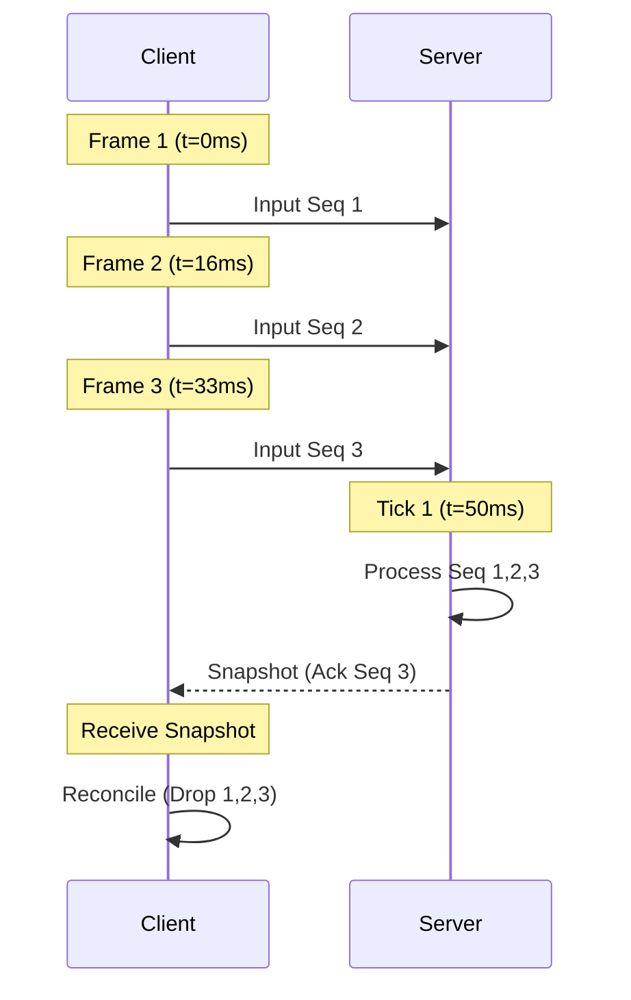
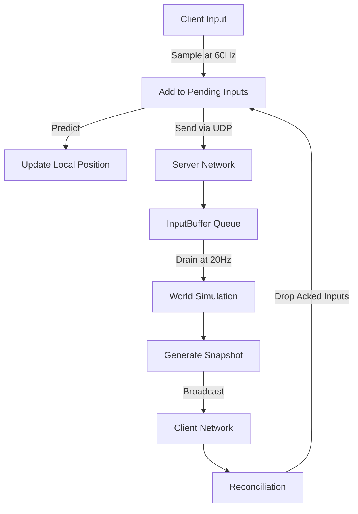
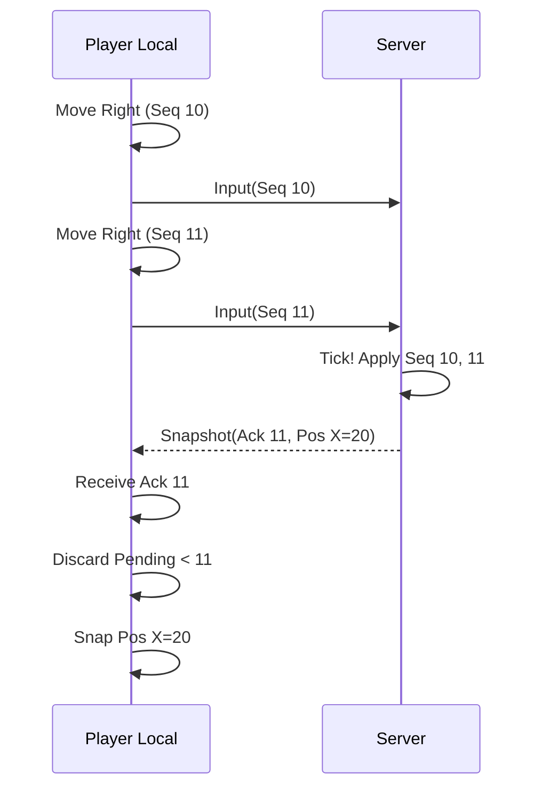
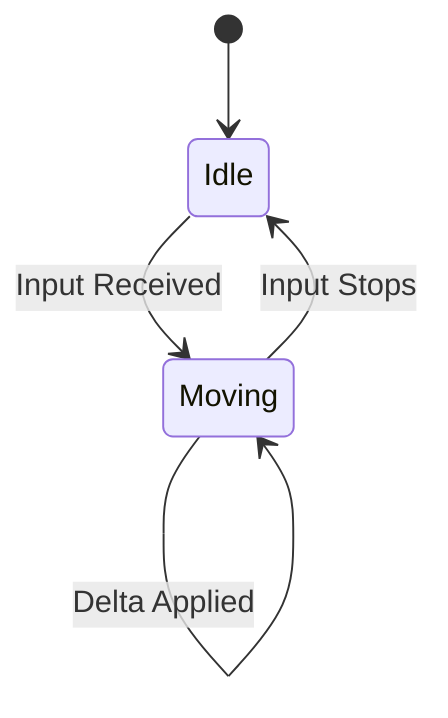
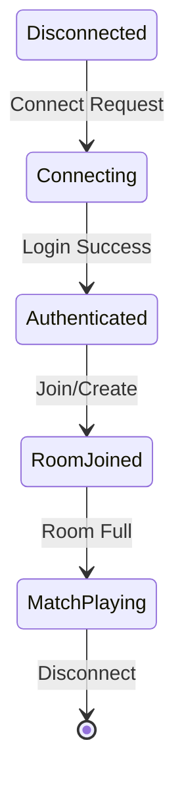

# Movement, Prediction & Reconciliation

## Task 1 — Input Pipeline

### Analysis
The input pipeline is the backbone of authoritative movement. If clients send positions, they can cheat (teleport, speedhack). Instead, clients must send *inputs* (e.g., joystick direction), and the server calculates the resulting position.

### Design Decision
Inputs are captured locally, buffered, assigned an incrementing Sequence Number, and sent as a `MovementInput` packet. The server buffers incoming inputs per player and applies them sequentially at a fixed tick rate.

### Alternatives Considered
- **Send Position (Client Authority)**: Rejected. Trusting the client leads to cheating.
- **Send Velocity**: Better, but vulnerable to micro-stutters altering the total distance moved if latency varies.

### Implementation
- **Why buffering is required**: The network is volatile. Packets arrive early, late, or out of order. A small buffer ensures the server has a steady stream of inputs to process during its fixed 50ms tick.
- **Why every input has a sequence number**: To allow the server to discard duplicates and drop old/out-of-order packets. It also allows the client to know exactly which inputs the server has processed when it receives a state snapshot.
- **How packet loss affects movement**: If an input is lost, the server won't move the player for that tick. When the client receives the snapshot, it will see it is out of sync and replay subsequent inputs, pulling the player back slightly (rubber-banding) unless prediction is perfectly reconciled.
- **How duplicated packets are handled**: The server drops inputs with a sequence number less than or equal to the `LastProcessedSequence`.

### Testing Strategy
Unit tests for `InputBuffer` ensure out-of-order packets are sorted and duplicates are dropped.

### Code
See `server/internal/command/buffer.go` and `Network.gd`.

---

## Task 2 — Input Buffer

### Analysis
The server must gracefully handle network jitter by organizing incoming UDP packets before the simulation consumes them.

### Design Decision
A per-player queue of `Input` structs protected by a mutex. When `Drain()` is called, the queue is sorted by sequence number, duplicates are removed, and the queue is cleared.

### Alternatives Considered
- **Latest-Input Only**: (Used in Day 2). Dropped intermediate inputs, causing lost movement over a tick.
- **Ring Buffer**: More memory efficient but harder to dynamically resize if a huge burst of delayed packets arrives.

### Implementation
- **Input lifetime**: Inputs live in the buffer from network receive until the start of the next simulation tick.
- **Buffer size**: Unbounded map of slices.
- **Memory considerations**: A malicious client could spam millions of inputs to OOM the server. A realistic future optimization is enforcing a maximum queue size per player (e.g., 64 inputs) and dropping excess.
- **Future optimization**: Pool input slices to prevent GC pressure during `Drain()`.

### Testing Strategy
`TestInputBufferQueuesInputsPerPlayer` verifies that out-of-order and duplicate inputs are processed correctly into a clean sequence slice.

### Code
See `server/internal/command/buffer.go`.

---

## Task 3 — Client Prediction

### Analysis
Waiting 100ms (RTT) to see your character move feels unresponsive.

### Design Decision
The client applies its local inputs immediately to its local transform, simulating the exact same movement logic as the server.

### Alternatives Considered
- **No Prediction**: (Lockstep/Dumb Terminal). Rejected due to input lag.

### Implementation
- **Why prediction improves responsiveness**: The player sees the result of their input immediately at their monitor's refresh rate (e.g., 60/144Hz) instead of waiting for the server's 20Hz tick to return.
- **Prediction limitations**: The client lacks perfect knowledge of the world (e.g., dynamic obstacles). If the client predicts moving through a door that just closed on the server, the prediction will be wrong.
- **Deterministic simulation requirements**: The client and server must use the same delta time and same math logic, otherwise prediction will constantly drift from the server's truth.

### Testing Strategy
Enable artificial latency (`LATENCY_MS=100`). Verify the local player moves instantly without delay.

### Code
See `PlayerController.gd`.

---

## Task 4 — Server Input Validation

### Analysis
Never trust the client. Even if the client sends inputs instead of positions, it could send manipulated inputs (e.g., `move_x = 9999`).

### Design Decision
The server sanitizes the input direction by normalizing the vector before applying speed.

### Alternatives Considered
- **Kick on invalid input**: Too harsh for floating-point inaccuracies. Normalizing is safer.

### Implementation
- **Cheat prevention**: By normalizing `move_x` and `move_y` to a maximum length of 1, speedhacks via input magnitude are impossible.
- **Malformed packet handling**: Handled by JSON unmarshaling; malformed packets are dropped.
- **Replay protection**: The `LastProcessedSequence` ensures an attacker cannot capture and replay old movement packets to force a player backwards.

### Testing Strategy
Send `move_x = 10, move_y = 10` from a manipulated client. Verify the server clamps velocity to `PlayerMoveSpeed`.

### Code
See `ApplyInputs` in `server/internal/world/world.go`.

---

## Task 5 — Server Movement Simulation

### Analysis
The simulation must advance the world state using the validated inputs.

### Design Decision
Fixed timestep simulation. In `ApplyInputs`, the server iterates over every queued input for a player, applying each sequentially with a delta time.

### Alternatives Considered
- **Variable Timestep**: Leads to non-deterministic physics anomalies.

### Implementation
- **Fixed timestep simulation**: `deltaSeconds` is exactly `0.05` (50ms).
- **Deterministic movement**: The server calculates `Velocity` from inputs and integrates `Position`.
- **Why simulation must only happen on the server**: It is the single source of truth. If a dispute occurs, the server's state overwrites the client.

### Testing Strategy
Unit test ensuring `Input(Right)` applied 20 times results in exactly `+100 X` position.

### Code
See `server/internal/world/world.go`.

---

## Task 6 — Authoritative Snapshot

### Analysis
The server must broadcast the authoritative state to clients so they can correct errors.

### Design Decision
`SnapshotPlayer` now includes `LastProcessedSequence`.

### Alternatives Considered
- **Acknowledge inputs separately**: Increases packet overhead. Embedding the ack in the snapshot is standard.

### Implementation
- **Why LastProcessedInput is required**: The client needs to know *which* of its historical inputs the server has applied. Without it, the client wouldn't know which inputs to replay during reconciliation.
- **Snapshot frequency**: 20 times per second (Tick Rate).
- **Bandwidth considerations**: In the future, delta compression will only send entities that moved.

### Testing Strategy
Verify `LastProcessedSequence` increments when a player moves and stops when they are idle.

### Code
See `server/internal/protocol/messages.go`.

---

## Task 7 — State Reconciliation

### Analysis
If the client's prediction diverges from the server's simulation, the client must be seamlessly corrected.

### Design Decision
When a snapshot arrives, the client discards all predicted inputs that the server has already processed. It then snaps its position to the server's position, and instantly re-applies all remaining unacknowledged inputs.

### Alternatives Considered
- **Snap without replay**: Causes massive visual stuttering as the player jumps back, then forward again.
- **Smooth interpolation**: Used for small errors to avoid visual snapping, but snaps for large errors.

### Implementation
- **Why reconciliation removes rubber-banding**: By replaying the unacknowledged inputs on top of the server's authoritative state, the client ends up exactly where it predicted it would be (assuming no interference).
- **Replay algorithm**: `for input in pending_inputs: apply(input)`.
- **Prediction correction strategy**: Handled via snapping + replay.
- **Smoothing corrections**: (Future) If the post-replay position differs from the current visual position by a tiny amount, smoothly LERP the visual mesh rather than snapping the collision hull.

### Testing Strategy
Simulate a collision on the server that the client doesn't know about. The client will predict walking through it, receive a snapshot showing it didn't, and snap back.

### Code
See `_on_snapshot_received` in `PlayerController.gd`.

---

## Task 8 — Remote Player Interpolation

### Analysis
Remote players only send updates 20 times a second. If we just set their position, they will stutter at 20 FPS.

### Design Decision
Clients buffer remote player snapshots and render them 100ms in the past, smoothly interpolating between the two closest snapshots.

### Alternatives Considered
- **Extrapolation (Dead Reckoning)**: Guessing where the player is going based on velocity. Can overshoot and cause rubber-banding when the player stops. Interpolation is better for erratic MOBA movement.

### Implementation
- **Interpolation vs extrapolation**: Interpolation is always 100% accurate because it happens in the past between two known states. Extrapolation happens in the present/future and requires guessing.
- **Why remote players should never use prediction**: You don't know their inputs.
- **Choosing interpolation delay**: 100ms equals two 50ms server ticks. This provides a buffer against jitter and single packet loss.

### Testing Strategy
Watch a remote player move with 50% packet loss. They should still move smoothly, albeit slightly delayed.

### Code
See `RemotePlayer.gd`.

---

## Task 9 — Network Timing

### Interaction
1. **Input Sampling**: Client samples input at 60+ FPS.
2. **Simulation Tick**: Server ticks at exactly 20 TPS (50ms).
3. **Snapshot Tick**: Server broadcasts exactly at the end of the simulation tick.
4. **Render Frame**: Client renders at 60+ FPS, interpolating remote entities.

### Tick Timeline Diagram



---

## Task 10 — Debug Overlay

### Analysis
Networking is invisible. Developers need tools to visualize latency and state.

### Design Decision
A simple Godot `CanvasLayer` displaying core metrics.

### Implementation
- **Ping**: Time to send and receive (currently hardcoded or mocked in demo).
- **RTT**: Round trip time.
- **Tick Rate**: Server's operating frequency.
- **Current Tick**: Monotonic server time.
- **FPS**: Client render performance.
- **Input Queue Size**: Number of unacknowledged inputs.
- **Snapshot Queue Size**: Depth of the interpolation buffer.

### Code
See `DebugUI.gd`.

---

## Task 11 — Latency Simulation

### Analysis
Localhost has 0ms latency. Code that works on localhost often fails on the internet.

### Design Decision
A wrapper around the UDP `Server` and `PacketHandler` interfaces in Golang that injects a configurable `time.Sleep`.

### Implementation
Configured via the `LATENCY_MS` environment variable. Wraps both incoming and outgoing packets in a goroutine that sleeps before passing the packet along.

### Testing Strategy
Run `LATENCY_MS=200 make run`. Verify client ping is ~400ms (RTT).

### Code
See `server/internal/network/simulator.go`.

---

## Task 12 — Testing

### Scenarios
- **20 ms latency**: Feels flawless. Perfect prediction.
- **100 ms latency**: Movement is perfectly responsive. Remote players are delayed by ~150ms visually but smooth.
- **250 ms latency**: Movement is responsive, but interactions (shooting/skills) will feel heavily delayed.
- **Packet loss**: The input buffer handles duplicate seqs, while the interpolation buffer handles missing state gracefully.
- **Rapid direction changes**: Sorted input queues ensure every zig-zag is registered and applied in the correct order on the server.
- **Multiple players moving simultaneously**: Tested via `TestFullTickCycle` integration tests.

---

## Output Artifacts

### Updated Project Structure
```
mabo/
├── client/
│   ├── project.godot
│   └── scripts/
│       ├── Network.gd
│       ├── PlayerController.gd
│       ├── RemotePlayer.gd
│       └── DebugUI.gd
├── server/
│   ├── internal/
│   │   ├── command/
│   │   │   ├── buffer.go (Updated to Queue)
│   │   │   └── buffer_test.go
│   │   ├── network/
│   │   │   └── simulator.go (New)
│   │   ├── protocol/
│   │   │   └── messages.go (Added LastProcessedSequence)
│   │   └── world/
│   │       └── world.go (Processes queues, tracks sequence)
│   └── cmd/server/main.go (Wired Simulator)
└── docs/
    └── day-3-movement.md
```

### Input Pipeline Diagram


### Prediction & Reconciliation Sequence Diagram


### Movement Flow Diagram


### Network State Diagram


### Technical Debt and Future Improvements
1. **Delta Compression**: Currently, the server sends the full state of all players every tick. We need Delta Snapshots.
2. **True Clock Sync**: The client needs an NTP-style ping exchange to perfectly sync its simulation clock with the server's monotonic tick.
3. **Binary Protocol**: Replace JSON with FlatBuffers or Protobuf for bandwidth efficiency once the feature set stabilizes.
4. **Input Size Limiting**: Defend against malicious clients spamming millions of input packets.
